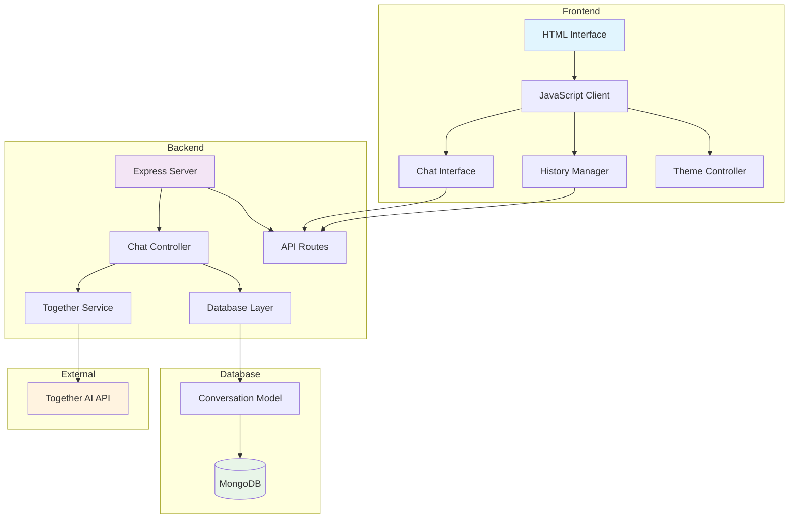
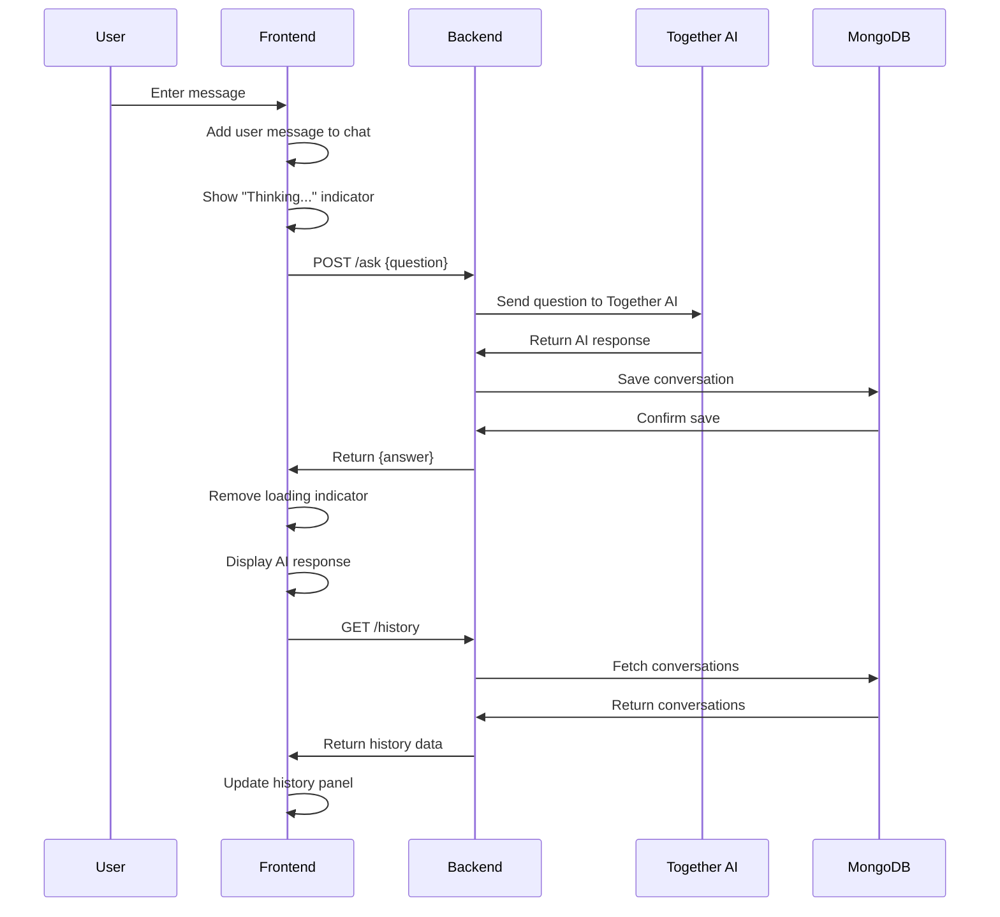
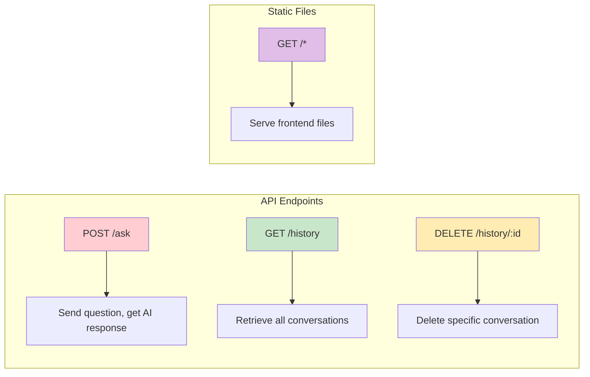
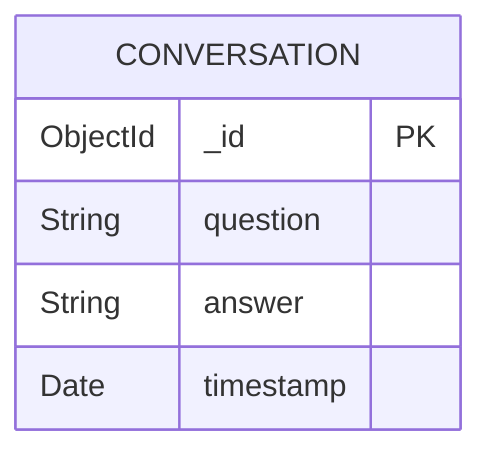

# 🤖 Chatbot

A modern, full-stack chatbot application built with Node.js, Express, and MongoDB. Features real-time conversations, conversation history, and a beautiful dark/light theme interface.

## ✨ Features

- 💬 Real-time chat interface
- 📚 Conversation history with persistent storage
- 🗑️ Delete individual conversations
- 🌙 Dark/Light theme toggle
- 🔄 Auto-scroll and loading indicators
- 📱 Responsive design
- 🚀 RESTful API architecture

## 🏗️ Architecture



## 🔄 Application Flow



## 🚀 Getting Started

### Prerequisites

- Node.js (v14 or higher)
- MongoDB (local or cloud)
- Together AI API key

### Installation

1. **Clone the repository**
   ```bash
   git clone <repository-url>
   cd chatbot
   ```

2. **Install dependencies**
   ```bash
   npm install
   ```

3. **Set up environment variables**
   Create a `.env` file in the root directory:
   ```env
   MONGO_URI=mongodb://localhost:27017/chatbot
   TOGETHER_API_KEY=your_together_ai_api_key
   PORT=3000
   ```

4. **Start the application**
   ```bash
   npm start
   ```

5. **Open your browser**
   Navigate to `http://localhost:3000`

## 📁 Project Structure

```
chatbot/
├── config/
│   └── database.js          # MongoDB connection configuration
├── controllers/
│   └── chatController.js    # Chat API logic
├── models/
│   └── conversation.js      # MongoDB conversation schema
├── services/
│   └── togetherService.js   # Together AI integration
├── public/
│   ├── index.html          # Frontend interface
│   ├── style.css           # Styling
│   └── script.js           # Frontend JavaScript
├── .env                    # Environment variables
├── package.json           # Project dependencies
└── server.js              # Express server setup
```

## 🛠️ API Endpoints



### Endpoint Details

| Method | Endpoint | Description | Request Body | Response |
|--------|----------|-------------|--------------|----------|
| POST | `/ask` | Send a question to the AI | `{question: string}` | `{answer: string}` |
| GET | `/history` | Get all conversations | None | `[{_id, question, answer, timestamp}]` |
| DELETE | `/history/:id` | Delete a conversation | None | `{message: string}` |

## 🎨 Frontend Features

### Chat Interface
- Real-time message display
- Auto-scrolling to latest messages
- Loading indicators during AI processing
- Clean, modern UI design

### History Management
- Persistent conversation storage
- Individual conversation deletion
- Automatic history refresh
- Chronological organization

### Theme System
- Dark/Light mode toggle
- Smooth transitions
- Persistent theme preference
- Accessible design

## 💾 Database Schema



## 🔧 Configuration

### Environment Variables

| Variable | Description | Required | Default |
|----------|-------------|----------|---------|
| `MONGO_URI` | MongoDB connection string | Yes | - |
| `TOGETHER_API_KEY` | Together AI API key | Yes | - |
| `PORT` | Server port | No | 3000 |

### MongoDB Setup

1. **Local MongoDB**
   ```bash
   # Install MongoDB
   # Start MongoDB service
   mongod
   ```

2. **MongoDB Atlas (Cloud)**
   - Create account at mongodb.com
   - Create cluster
   - Get connection string
   - Update MONGO_URI in .env

## 🧪 Testing

### Manual Testing Checklist

- [ ] Send a message and receive AI response
- [ ] Check conversation appears in history
- [ ] Delete a conversation from history
- [ ] Toggle between dark/light themes
- [ ] Test Enter key for sending messages
- [ ] Verify auto-scroll functionality

### API Testing with curl

```bash
# Test sending a question
curl -X POST http://localhost:3000/ask \
  -H "Content-Type: application/json" \
  -d '{"question": "Hello, how are you?"}'

# Test getting history
curl http://localhost:3000/history

# Test deleting a conversation
curl -X DELETE http://localhost:3000/history/CONVERSATION_ID
```

## 🚀 Deployment

### Local Development
```bash
npm run dev  # If you have nodemon configured
# or
npm start
```

### Production Deployment
1. Set production environment variables
2. Configure MongoDB for production
3. Use process manager like PM2
4. Set up reverse proxy (nginx)
5. Configure SSL/HTTPS

## 🤝 Contributing

1. Fork the repository
2. Create a feature branch (`git checkout -b feature/amazing-feature`)
3. Commit your changes (`git commit -m 'Add some amazing feature'`)
4. Push to the branch (`git push origin feature/amazing-feature`)
5. Open a Pull Request

## 📝 License

This project is licensed under the MIT License - see the LICENSE file for details.

## 🙏 Acknowledgments

- Together AI for providing the AI model API
- MongoDB for the database solution
- Express.js for the web framework
- The open-source community for inspiration

---

**Made with ❤️ by [Your Name]**
